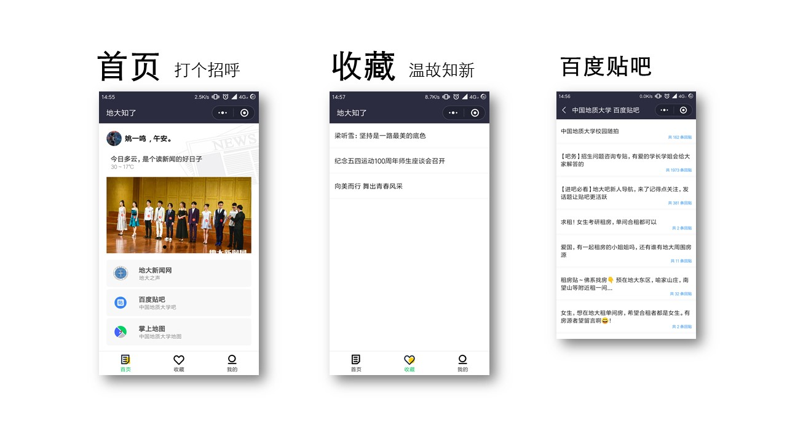
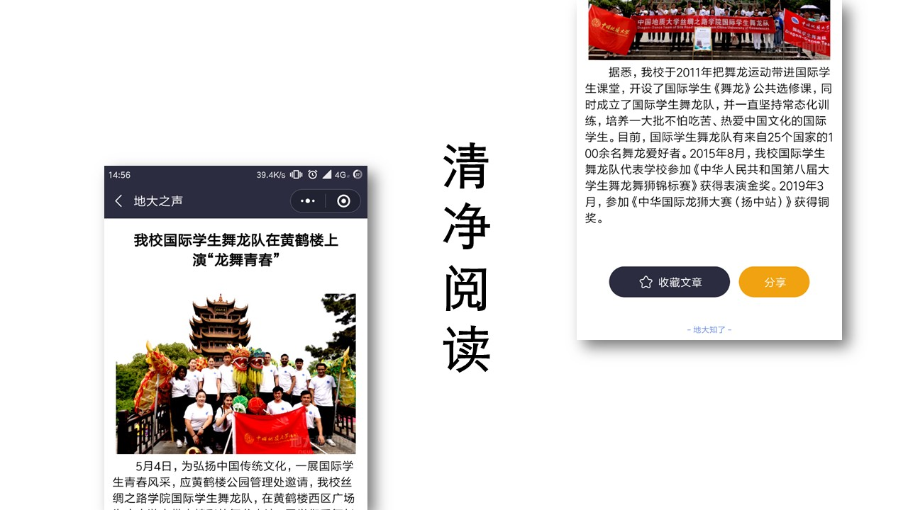

## <b>地大知了 微信小程序</b>
### 中国地质大学(武汉) 白给小组

---

### 应用介绍
一个简易的高校新闻及讲座资讯小程序，帮助中国地质大学校园内的同学们快速获取校园的新闻。
使用我们的小程序，您可以：
- 每天打开小程序看到您身边的天气
- 查看地大新闻网地大之声的最新资讯
- 收藏和分享您喜欢的文章
- 浏览地大的百度贴吧最新帖子
- 查看地大的地图

### 小程序截图 (图标及部分资源图片来自网络)
#### 功能

#### 阅读

### 引用
| 名字 | 许可类型 | 项目网站 |
| --- | --- | --- |
| wxParse | [MIT License](https://github.com/icindy/wxParse/blob/master/LICENSE) | [github.com/icindy/wxParse](https://github.com/icindy/wxParse) |
| baidumapapi | - | [github.com/baidumapapi/wxapp-jsapi](https://github.com/baidumapapi/wxapp-jsapi) |

---

2019 中国地质大学(武汉)
